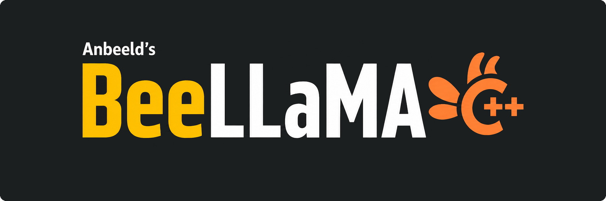

# Anbeeld's BeeLlama.cpp



BeeLlama.cpp (or just Bee) is a performance-focused llama.cpp fork for squeezing more speed and context out of local GGUF inference. It adds variance-normalized KV-cache quantization (KVarN), KV cache precision tail for recent tokens, low-bit cache types, adaptive draft control for speculative decoding, reasoning-loop protection, and more.

> Not quite a pegasus, but close enough.

[](https://anbeeld.com/support)

## Fork Features

- **Variance-normalized KV-cache quantization (KVarN)**: provides higher precision at similar memory costs. Independent K and V bit widths at `kvarn2`, `kvarn3`, `kvarn4`, `kvarn5`, `kvarn6`, and `kvarn8`, set with `--cache-type-k` and `--cache-type-v`.
- **KV cache precision tail**: keep most of the KV cache quantized while storing recent tokens in F16/BF16, enabled with `--kv-tail-tokens`. A single global softmax merges the quantized body and the precision tail under FlashAttention, without materializing the whole cache.
- **Standard low-bit KV cache types**: `q2_0`, `q2_1`, `q3_0`, `q3_1`, `q6_0`, and `q6_1`, usable for either target or draft caches alongside the upstream `q4`/`q5`/`q8` types.
- **Adaptive draft-max for DFlash**: adjusts the active DFlash draft horizon at runtime instead of using a fixed `--spec-draft-n-max`, comparing speculative throughput against a no-spec baseline.
- **Reasoning-loop protection**: the server detects repeated hidden reasoning output and intervenes.

For the full feature and public-repo comparison, read [docs/beellama-features.md](docs/beellama-features.md). For the complete argument reference, read [docs/beellama-args.md](docs/beellama-args.md).

### Migrating from v0.3.1 to v0.4.0

v0.4.0 replaced the fork's DFlash implementation in favor of upstream one for maintainability, and removed TurboQuant/TCQ due to benchmarks failing to prove any benefit over the standard quants. Use the newly added `kvarn2`…`kvarn8` types as the "better precision at same bits" KV cache, or fall back to the usual types with the fork now expanding the ladder to the full `q2_0`…`q8_0` range.

## KV Cache Quantization

K and V cache types are set independently with `--cache-type-k` and `--cache-type-v`. For the preset rationale and benchmark details, see [KV Cache Quantization Benchmarks for Long Context](https://anbeeld.com/articles/kv-cache-quantization-benchmarks-for-long-context).

> KVarN and KV-precision-tail benchmarks are being re-measured for v0.4.0. The standard-type ladder below is unchanged; the KVarN rows will land once the new KLD runs are complete.

### Preset Ladder

| K / V | % of bf16 size | 99.9% precision | What it is for |
| --- | ---: | ---: | --- |
| bf16 / bf16 | 100.0 | 100.00% | Preserving full quality |
| q8_0 / q8_0 | 53.1 | 94.62% | Validation and blame-isolation mode |
| **q8_0 / q6_0** | **46.9** | **94.33%** | **Recommended high-end preset** |
| q8_0 / q5_1 | 45.3 | 94.21% | Fallback if q6_0 V is unavailable |
| q8_0 / q5_0 | 43.8 | 93.69% | If the high-end rows miss the fit by a narrow margin |
| q6_0 / q5_0 | 37.5 | 93.29% | Optional headroom tier between q5 and q8 K |
| q5_0 / q5_0 | 34.4 | 93.16% | Normal quality preset |
| **q5_0 / q4_1** | **32.8** | **92.65%** | **Best default if VRAM-constrained** |
| q5_0 / q4_0 | 31.3 | 91.39% | If q5_0 / q4_1 misses the fit by a narrow margin |
| q4_0 / q4_0 | 28.1 | 88.87% | Memory saving with visible precision loss |

*99.9% precision = `100 · exp(−(quantKLD − bf16KLD))` at the 99.9% KL-divergence tail.*

### Type Reference

| Type | Origin | bpv | Diff vs bf16 | Notes |
| --- | --- | ---: | ---: | --- |
| q8_0 | upstream | 8.5 | 1.88× | High-fidelity K or V |
| q6_0 | upstream | 6.5 | 2.46× | Robust type for high-end presets |
| q5_1 | upstream | 6 | 2.67× | Conservative, might be better for V than q5_0 |
| q5_0 | upstream | 5.5 | 2.91× | Strong K type for VRAM constrained configs |
| q4_1 | upstream | 5 | 3.2× | Smaller than q5_0, but weaker in the tail. Prefer q5_0 for K |
| q4_0 | upstream | 4.5 | 3.56× | Default high compression type, decent at its size |

## Installation

### Prebuilt

Current release binaries are on the [releases page](https://github.com/Anbeeld/beellama.cpp/releases):

| Platform | Backend | Archive |
| --- | --- | --- |
| macOS arm64 | Metal | `bin-macos-arm64.tar.gz` |
| Ubuntu x64 | CPU | `bin-ubuntu-x64.tar.gz` |
| Ubuntu arm64 | CPU | `bin-ubuntu-arm64.tar.gz` |
| Ubuntu x64 | CUDA 12.4 | `bin-ubuntu-cuda-12.4-x64.tar.gz` |
| Ubuntu x64 | CUDA 13.1 | `bin-ubuntu-cuda-13.1-x64.tar.gz` |
| Ubuntu x64 | Vulkan | `bin-ubuntu-vulkan-x64.tar.gz` |
| Ubuntu x64 | ROCm 7.2 | `bin-ubuntu-rocm-7.2-x64.tar.gz` |
| Ubuntu x64 | SYCL | `bin-ubuntu-sycl-x64.tar.gz` |
| Windows x64 | CPU | `bin-win-cpu-x64.zip` |
| Windows x64 | SYCL | `bin-win-sycl-x64.zip` |
| Windows x64 | CUDA 12.4 | `bin-win-cuda-12.4-x64.zip` |
| Windows x64 | CUDA 13.1 | `bin-win-cuda-13.1-x64.zip` |
| Windows x64 | HIP/Radeon | `bin-win-hip-radeon-x64.zip` |

Windows CUDA archives contain a `ggml-cuda.dll` backend; download the matching `cudart-win-cuda-*-x64.zip` runtime archive and extract it into the same folder. Windows SYCL and HIP archives ship as standalone packages with all required runtime DLLs bundled.

Docker images are published to `ghcr.io/anbeeld/beellama.cpp`:

| Image | Acceleration | Platforms |
| --- | --- | --- |
| `server`, `server-cpu` | CPU | linux/amd64, linux/arm64 |
| `server-cuda`, `server-cuda12` | CUDA 12.4 | linux/amd64 |
| `server-cuda13` | CUDA 13.1 | linux/amd64 |
| `server-rocm` | ROCm | linux/amd64 |
| `server-vulkan` | Vulkan | linux/amd64 |
| `server-sycl` | SYCL | linux/amd64 |

Building from source with `-DGGML_NATIVE=ON` *may* result in a *tiny* bit better performance, so it might still be a good idea to do that if/when you decide to use this fork long-term.

### CUDA Build

```bash
# Linux (GCC + CUDA)
cmake -B build -DGGML_CUDA=ON -DGGML_NATIVE=ON \
  -DGGML_CUDA_FA=ON \
  -DCMAKE_BUILD_TYPE=Release
cmake --build build -j

# Windows (MSVC + CUDA)
cmake -B build -DGGML_CUDA=ON -DGGML_NATIVE=ON ^
  -DGGML_CUDA_FA=ON ^
  -DCMAKE_BUILD_TYPE=Release
cmake --build build --config Release --parallel

# macOS (Metal)
cmake -B build -DGGML_METAL=ON -DCMAKE_BUILD_TYPE=Release
cmake --build build -j
```

The default FlashAttention build covers 103 standard cache pairs and 15 KVarN fast-decode pairs, which is enough for normal KVarN and low-bit use. Add `-DGGML_CUDA_FA_ALL_QUANTS=ON` to compile all 169 standard and 36 KVarN pairs, or `-DGGML_CUDA_KVARN=OFF` to build without any dedicated KVarN kernels. Add `-DCMAKE_CUDA_ARCHITECTURES=86` for RTX 3090, or `-DCMAKE_CUDA_ARCHITECTURES=89` for RTX 4090, if cross-compiling or building in CI without a GPU.

### Other Backends

Bee inherits llama.cpp backend support, including Metal, HIP, Vulkan, SYCL, BLAS, CANN, MUSA, OpenVINO, OpenCL, and RPC. Use the upstream-style build docs in [docs/build.md](docs/build.md) and backend-specific pages under [docs/backend](docs/backend).

## Common Commands

### Local CLI

```sh
llama-cli -m model.gguf
llama-cli -m model.gguf -cnv --chat-template chatml
llama-cli -m model.gguf -n 256 --grammar-file grammars/json.gbnf -p "Request: schedule a call at 8pm; Command:"
```

### OpenAI-Compatible Server

```sh
llama-server -m model.gguf --port 8080
llama-server -m model.gguf -c 16384 -np 4
llama-server -m model.gguf -md draft.gguf
```

### DFlash Speculative Decoding

```sh
llama-server -m target.gguf --spec-type draft-dflash \
  --spec-draft-model drafter.gguf \
  --spec-draft-ngl all \
  --spec-dm-controller profit \
  --flash-attn on --cache-type-k q5_0 --cache-type-v q4_1
```

Keep the draft context on a standard cache type; KVarN is target-cache only.

### KVarN Target Cache

```sh
llama-server -m model.gguf --flash-attn on \
  --cache-type-k kvarn4 --cache-type-v kvarn4 --kv-tail-tokens 512
```

### Router Mode With Presets

```sh
llama-server --models-dir /path/to/models
llama-server --models-preset presets.ini
```

## Documentation

- [BeeLlama features and public repo diff](docs/beellama-features.md)
- [BeeLlama args reference](docs/beellama-args.md)
- [Build docs](docs/build.md)
- [Server docs](tools/server/README.md)
- [Docker docs](docs/docker.md)
- [Performance troubleshooting](docs/development/token_generation_performance_tips.md)

## Contributing

Keep PRs small and scoped. Run the narrowest relevant tests or benchmarks before opening a PR, and include the exact commands. For fork-specific changes, update the corresponding docs when behavior or args change.

Read [CONTRIBUTING.md](CONTRIBUTING.md) for inherited llama.cpp contribution conventions and this fork's AI usage policy.

## Dependencies

- [yhirose/cpp-httplib](https://github.com/yhirose/cpp-httplib) - single-header HTTP server used by `llama-server` - MIT
- [stb-image](https://github.com/nothings/stb) - single-header image decoder used by multimodal code - public domain
- [nlohmann/json](https://github.com/nlohmann/json) - single-header JSON library - MIT
- [miniaudio.h](https://github.com/mackron/miniaudio) - single-header audio decoder - public domain
- [subprocess.h](https://github.com/sheredom/subprocess.h) - process launching helper - public domain
- [Snowflake ArcticInference](https://github.com/snowflakedb/ArcticInference) - suffix tree and int32 map used in speculative decoding (`common/suffix-tree.*`, `common/int32-map.h`) - Apache-2.0
- [Intel OpenVINO](https://github.com/openvinotoolkit/openvino) - frontend header used in OpenVINO backend (`ggml/src/ggml-openvino/openvino/frontend.h`) - Apache-2.0
- Intel SYCL/oneAPI - SYCL backend (`ggml/src/ggml-sycl/`) - Apache-2.0 WITH LLVM-exception

See the `licenses/` directory for full license texts.

[](https://anbeeld.com/support)
